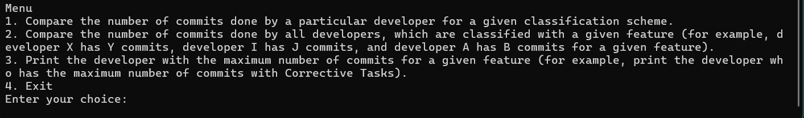
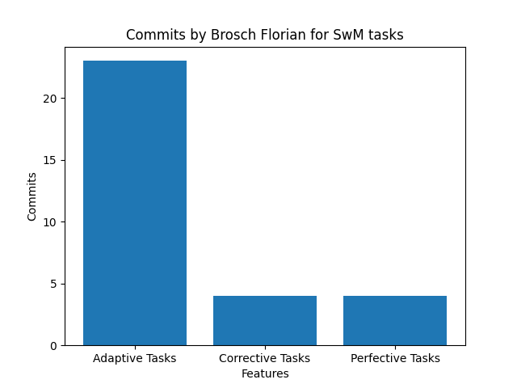
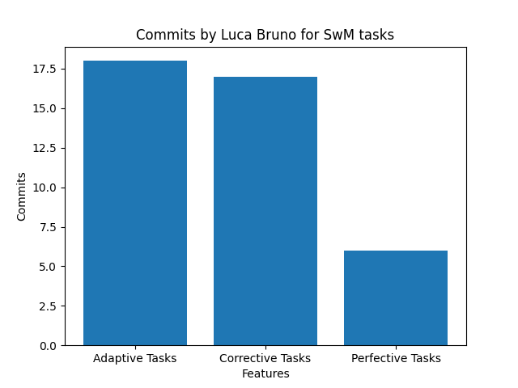

# Python Data Analyzer for Git Commit Messages

Developed a Python-based analytical tool to process and visualize classified Git commit messages, offering actionable insights into developer contributions across various software maintenance and evolution activities.

This command-line tool parses and aggregates data from `commits.txt` and `identities.txt` to build a queryable in-memory database, allowing for dynamic analysis and visualization of developer activity.


---

## 🚀 Core Features

* **Command-Line Interface:** Accepts input file paths (`identities.txt`, `commits.txt`) via command-line arguments (`sys.argv`) for flexible use.
* **Identity Consolidation:** Parses `identities.txt` to map multiple committer IDs (e.g., different emails for the same person) to a single, unified developer identity.
* **Complex Data Aggregation:** Builds a nested dictionary data model to track statistics for each developer across three different classification schemes:
    * **Software Maintenance (SwM)**
    * **Software Evolution (SoftEvol)**
    * **NFR Labelling (NFL)**
* **Interactive Query Menu:** Once loaded, the tool presents an interactive menu for running dynamic analyses without reloading the data.
* **Data Visualization:** Integrates `matplotlib` to generate bar charts for comparing developer statistics or feature activities.
* **Robust Error Handling:** Includes exception handling for file I/O and user input to ensure a smooth user experience.

---

## 📈 How It Works

### 1. Data Ingestion & Modeling

The tool is launched by passing the two data files as command-line arguments.

1.  **Identity Mapping:** It first reads `identities.txt` to create a "master list" of developers.
2.  **Commit Parsing:** It then reads `commits.txt` line by line. For each commit, it:
     * Finds the master identity for the committer ID.
     * Parses the 13 classification features (e.g., `SwM`, `SoftEvol`, `NFL`).
     * Aggregates these counts into a large nested dictionary.

The final data structure looks similar to this:

```python
all_commits = {
  	 'Developer_Name_1': {
  	 	 'total_commits': 150,
  	 	 'SwM': { 'feature_1': 20, 'feature_2': 10, ... },
  	 	 'SoftEvol': { 'feature_1': 5, ... },
  	 	 'NFL': { 'feature_1': 30, ... }
  	 },
  	 'Developer_Name_2': { ... }
}
```

### 2. Interactive Analysis

After processing, the user is presented with a menu to:
* **Compare Schemes:** Generate a bar chart comparing the SwM, SoftEvol, and NFL totals for a *single developer*.
* **Compare Features:** Generate a bar chart comparing the values of a *single feature* (e.g., `SwM_1`) across *all developers*.
* **Find Top Contributor:** Print the name of the developer with the maximum number of commits for a *specific feature*.






---

## 🚀 How to Run

### Prerequisites
* Python 3
* `matplotlib` (`pip install matplotlib`)

### 1. Run the Analyzer
Provide the paths to the `identities.txt` and `commits.txt` files as command-line arguments.

```bash
python commitsanalyser.py ./identities.txt ./commits.txt
```

### 2. Use the Interactive Menu
Once the data is loaded, the menu will appear. You can then select an option to run an analysis.

```
--- MENU ---
1. Compare classification schemes for a developer
2. Compare a specific feature for all developers
3. Find the developer with the maximum commits for a feature
4. Exit

Select an option: 1
Enter developer name: John Doe
(Bar chart is generated and displayed)

Select an option: 3
Enter feature (e.g., SwM_1): NFL_4
Developer with the most commits for NFL_4: Jane Smith (42 commits)

Select an option: 4
Exiting...
```